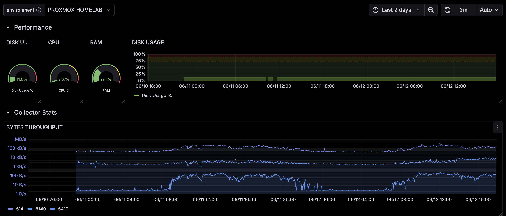

# Hades: Tailscale Monitoring Stack

> **Note:** This documentation was enhanced with AI assistance to improve clarity and organization.

A complete monitoring solution built for Tailscale private networks, featuring Prometheus, Grafana, Loki, and custom network traffic exporters.



Information flow inside a Tailscale's Tailnet:


## Overview

This monitoring stack provides comprehensive observability for infrastructure deployed across Tailscale networks. It includes custom exporters for firewall traffic monitoring and is designed to work seamlessly with Tailscale's hostname conventions.

### Key Features

- **Prometheus** - Metrics collection and storage
- **Grafana** - Visualization and dashboards  
- **Loki** - Log aggregation (configured but not deployed in docker-compose)
- **Alertmanager** - Alert routing and management (configured but not deployed)
- **Custom Network Exporters** - iptables and conntrack monitoring for syslog traffic
- **Tailscale Integration** - Uses Tailscale hostnames for service discovery

## Quick Start

1. **Set environment variables:**
   ```bash
   export GRAFANA_PASSWORD=your_secure_password
   ```

2. **Set up data directories:**
   ```bash
   # Prometheus data ownership (runs as nobody:65534)
   sudo chown -R 65534:65534 prometheus-data/data
   
   # Grafana data ownership (optional - see Grafana Setup section)
   sudo groupadd -g 472 grafana
   sudo usermod -aG grafana $USER
   ```

3. **Start the stack:**
   ```bash
   docker-compose up -d
   ```

4. **Access services:**
   - Grafana: http://localhost:3000 (admin/your_password)
   - Prometheus: http://localhost:9090

## Project Structure

```
├── docker-compose.yml           # Main services orchestration
├── prometheus-data/
│   └── prometheus.yml          # Prometheus configuration
├── grafana/
│   └── dashboards/            # Grafana dashboard definitions
├── loki/
│   └── loki.yaml             # Loki configuration (standalone)
├── alertmanager/
│   └── alertmanager.yml      # Alertmanager configuration (standalone)
├── firewall-logging/
│   ├── conntrack_exporter.sh # Connection tracking metrics
│   ├── iptables_exporter.sh  # iptables rule metrics
│   └── iptables-set.sh       # iptables rule setup
├── scripts/
│   ├── bootstrap_collector.sh # Node exporter installation
│   └── port_traffic.sh       # Port monitoring script
└── images/                   # Dashboard screenshots
```

## Tailscale Integration

This stack leverages Tailscale's hostname convention: `$CLIENT-$HOSTNAME`

- **CLIENT**: Environment identifier (dev, prod, proxmox, homelab, etc.)
- **HOSTNAME**: Actual server name or alias

This enables fine-grained filtering in Prometheus queries and Grafana dashboards.

## Custom Exporters

### Conntrack Exporter
Monitors active TCP connections on specified ports (61001, 61002, 61003):
- `syslog_active_senders_count` - Number of unique source IPs
- `syslog_active_senders_bytes{src="..."}` - Bytes per source IP

### iptables Exporter  
Tracks iptables rule statistics for monitored ports:
- `syslog_port_packets_total` - Total packets for port
- `syslog_port_bytes_total` - Total bytes for port

### Usage
Deploy exporters on monitored hosts and configure cron jobs:
```bash
# Install node_exporter first
./scripts/bootstrap_collector.sh

# Set up iptables rules
./firewall-logging/iptables-set.sh

# Add to crontab for regular metrics collection
*/5 * * * * /path/to/conntrack_exporter.sh
*/5 * * * * /path/to/iptables_exporter.sh
```

## Configuration

### Adding Monitored Hosts

Edit `prometheus-data/prometheus.yml`:
```yaml
scrape_configs:
  - job_name: 'collector-nodes'
    static_configs:
      - targets: ['tailscale-ip:9100']
        labels:
          client: your_environment    # dev, prod, etc.
          collector: your_hostname    # server identifier
```

### Port Monitoring

Update port lists in both exporter scripts:
- `firewall-logging/conntrack_exporter.sh` (PORTS array)
- `firewall-logging/iptables_exporter.sh` (SYSLOG_PORTS array)

## Grafana Setup

### Basic Usage
Grafana runs with default settings. Access at http://localhost:3000 with admin/your_password.

### Advanced: File System Access

For direct access to Grafana configuration files without sudo:

1. **Create grafana group and add user:**
   ```bash
   sudo groupadd -g 472 grafana
   sudo usermod -aG grafana $USER
   exec su -l $USER  # Restart shell session
   ```

2. **Set permissions:**
   ```bash
   sudo chmod -R g+rw grafana-data/
   sudo find grafana-data/ -type d -exec chmod g+s {} +
   ```

3. **Set umask for group-writable files:**
   ```bash
   echo 'umask 002' >> ~/.bashrc
   source ~/.bashrc
   ```

This allows editing Grafana files without sudo while maintaining Docker security.

## Security Notes

- Change default Grafana password via environment variable
- Consider using Grafana's built-in user management instead of hardcoded passwords
- Firewall exporters require sudo access for conntrack and iptables commands
- All services are exposed on localhost - use reverse proxy for external access

## Extending the Stack

The configurations include Loki and Alertmanager setups that can be integrated:

- **Loki**: Add to docker-compose.yml for log aggregation
- **Alertmanager**: Add to docker-compose.yml for alert management  
- **Additional Exporters**: Follow the pattern in firewall-logging/ for custom metrics
